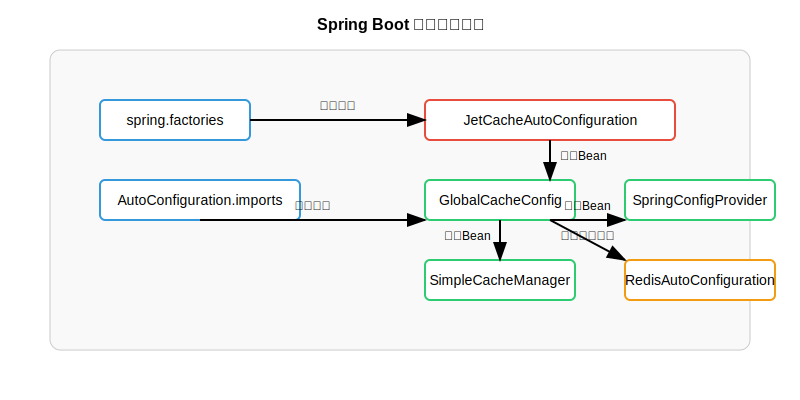
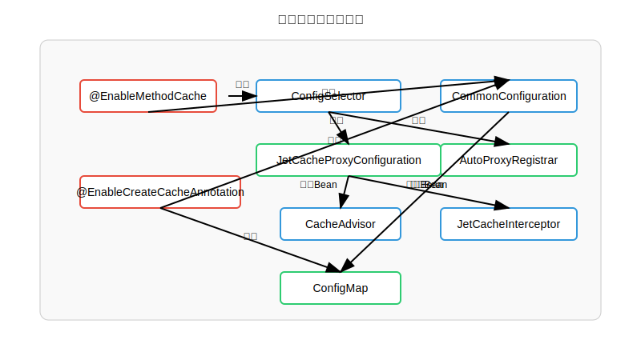
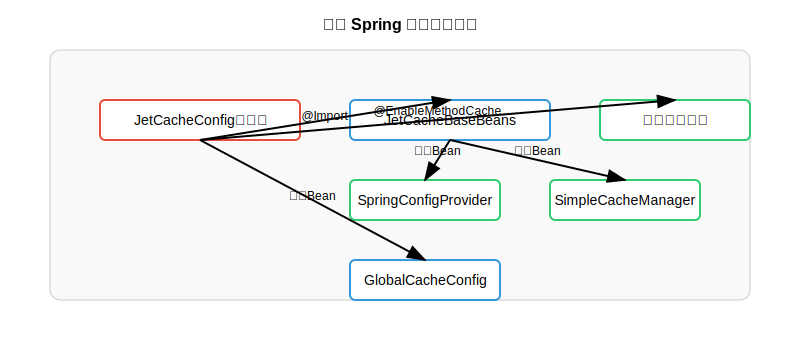
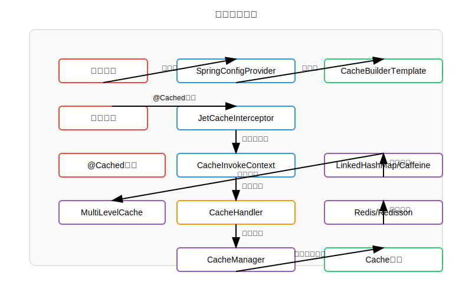
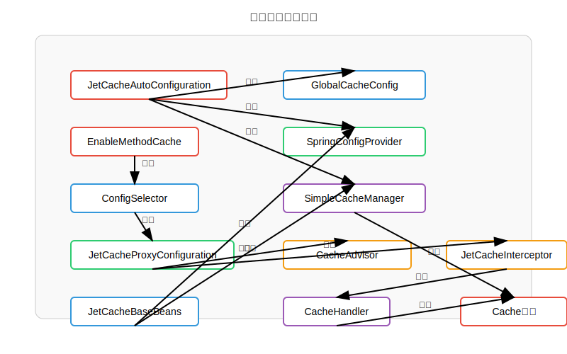

# JetCache Spring 拓展入口与工作流程

## Spring Boot 自动配置入口




## 注解驱动的拓展入口




## 传统 Spring 配置方式入口




## 缓存工作流程




## 核心类与接口关系




## 主要拓展入口总结

1. **Spring Boot 自动配置入口**
   - `JetCacheAutoConfiguration`：自动配置类，位于 `jetcache-autoconfigure` 模块
   - 通过 `spring.factories` 和 `AutoConfiguration.imports` 文件自动注册
   - 创建全局配置和核心 Bean

2. **注解驱动拓展**
   - `@EnableMethodCache`：启用方法缓存，支持 `@Cached`、`@CacheUpdate`、`@CacheInvalidate` 注解
   - `@EnableCreateCacheAnnotation`：启用字段缓存（已废弃，推荐使用 CacheManager）
   - `ConfigSelector`：根据代理模式选择合适的配置类

3. **AOP 实现**
   - `JetCacheInterceptor`：核心拦截器，处理缓存方法调用
   - `CacheAdvisor`：切面通知器
   - `CachePointcut`：定义缓存切点

4. **配置管理**
   - `GlobalCacheConfig`：全局缓存配置
   - `JetCacheProperties`：配置属性类，对应 `jetcache` 前缀的配置
   - `SpringConfigProvider`：Spring 环境下的配置提供者

5. **缓存管理**
   - `SimpleCacheManager`：缓存实例管理器
   - `CacheBuilderTemplate`：缓存构建模板

## 使用示例

### Spring Boot 方式

```java
@SpringBootApplication
@EnableMethodCache(basePackages = "com.example")
public class Application {
    public static void main(String[] args) {
        SpringApplication.run(Application.class, args);
    }
}
```

### 传统 Spring 方式

```java
@Configuration
@EnableMethodCache(basePackages = "com.example")
@Import(JetCacheBaseBeans.class)
public class JetCacheConfig {
    @Bean
    public GlobalCacheConfig config() {
        // 配置本地和远程缓存构建器
        // ...
        return globalCacheConfig;
    }
}
```